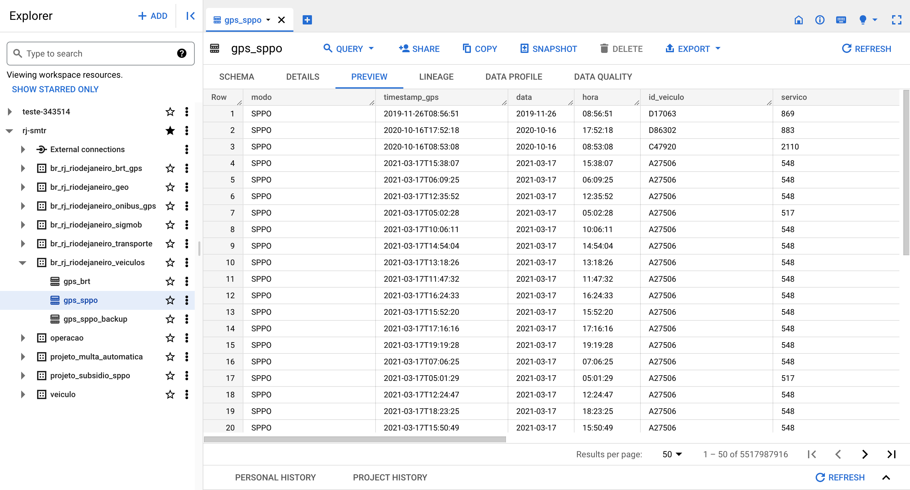
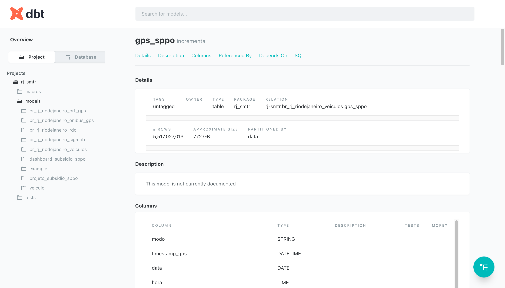
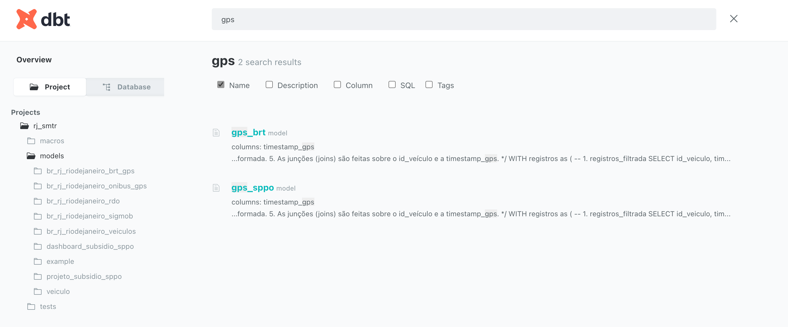
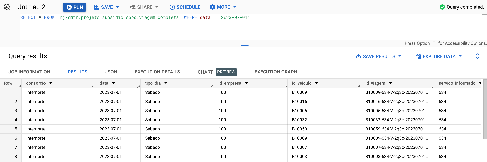

O data lake da SMTR contém os dados de operação, planejamento e
monitoramento do sistema de transporte municipal da cidade. Esses dados são fonte para a execução de diferentes políticas públicas da secretaria, como o [Subsídio dos ônibus](transportes.prefeitura.rio/subsidio) e a [Câmara de Compensação Tarifária (CCT)](transportes.prefeitura.rio/cct)


## Catálogo de dados

Abaixo você encontra a lista de todas as bases que constam atualmente no nosso data lake.

<!-- <iframe width="950" height="600" src="https://docs.google.com/spreadsheets/d/1EMYVcMPczLUdHHfr0T6yqL79m9Lm42GFj_d5zfWOUiM/edit?usp=sharing"></iframe> -->

<iframe width="800" height="600" src="https://lookerstudio.google.com/embed/reporting/bc1e2915-4136-449d-9951-3bbe9debf20e/page/AqD1D" frameborder="0" style="border:0" allowfullscreen sandbox="allow-storage-access-by-user-activation allow-scripts allow-same-origin allow-popups allow-popups-to-escape-sandbox"></iframe>

## Como acessar o data lake

## Conheça os dados de transporte público da cidade

<!-- 
**Primeira vez? Leia o restante da página e siga o passo a passo de como acessar o datalake.**

<html>
<head>
<style>
.grid-container {
  display: grid;
  grid-template-columns: auto auto auto;
  /* background-color: #2196F3; */
  padding: 10px;
}
.grid-item {
  /* background-color: rgba(255, 255, 255, 0.8); */
  border: 1px solid #F5F5F5;
  padding: 20px;
  font-size: 20px;
  text-align: center;
}
</style>
</head>
<body>

<div class="grid-container">
    <div class="grid-item">
        <a href="https://console.cloud.google.com/bigquery?p=rj-smtr&page=project">
        
        <br>Acesse o datalake público</a>
    </div>
    <div class="grid-item" href="https://docs.mobilidade.rio/">
        <a href="https://docs.mobilidade.rio">
        
        <br>Acesse o catálogo de dados</a>
    </div>
</div>

</body>
</html>

## Catálogo de dados

No catálogo você encontra a lista dos dados existentes no datalake, contendo informações como:

- Campos existentes nas tabelas
- Descrição de colunas e tabelas
- Relações entre as tabelas

No canto superior do catálogo é possível **buscar dados por campos e
palavras-chaves**. 

### Exemplo: Busca por dados de GPS dos ônibus

Abaixo buscamos pelo termo "gps" nos nomes (*Names*) de todas as tabelas.



Selecionando a tabela de ônibus (SPPO), podemos ver sua descrição, tamanho e onde encontrá-la
no datalake (*Relation*). Logo abaixo vemos também a lista e descrição
de suas colunas.


## Datalake: O que é o Google BigQuery

??? Info "A documentação foi adaptada de [BigQuery - Base dos Dados](https://basedosdados.github.io/mais/access_data_bq/)"

O BigQuery é o um serviço de banco de dados em nuvem da
Google. Você faz consultas ao banco em SQL direto do navegador com:

- **Rapidez**: Mesmo queries muito longas demoram apenas minutos para serem processadas.

- **Escala**: O BigQuery escala magicamente para hexabytes se necessário.

- **Economia**: Todo usuário possui *1 TB gratuito por mês para consulta
  aos dados*.

Para acessar os dados, siga o passo a passo abaixo.

### Crie seu projeto gratuito para acessar os dados

Para criar um projeto no Google Cloud basta ter um email cadastrado no
Google. É necessário ter um projeto seu, mesmo que vazio, para você
fazer queries em nosso *datalake* público.

- **[Acesse o Google Cloud](https://console.cloud.google.com/projectselector2/home/dashboard)**.
   Caso for a sua primeira vez, aceite o Termo de Serviços.
- **Clique em `Create Project/Criar Projeto`**. Escolha um nome bacana
  para o projeto e pronto!

!!! Info "Por que eu preciso criar um projeto no Google Cloud?"
    O projeto é necessário para ativar os serviços do Google Cloud,
    incluindo o uso do BigQuery. Pense no projeto como a "conta" na qual
    a Google vai contabilizar o quanto de processamento você já
    utilizou.
    
    - **A Google fornece 1 TB gratuito por mês de uso do BigQuery para cada
    projeto que você possui. [Entenda](https://cloud.google.com/bigquery/pricing?hl=pt#free-tier)**
    
    - **Não é necessário adicionar forma de pagamento**: O
    BigQuery inicia no modo Sandbox, para quem quer
    explorar dentro das cotas gratuitas. [Entenda](https://cloud.google.com/bigquery/docs/sandbox/?hl=pt).
    
### Acesse o datalake da SMTR

No BigQuery você encontra nosso datalake pelo nome `rj-smtr`, que você
pode acessar direto no botão abaixo.

- [Acesse o datalake aqui ↗️](https://console.cloud.google.com/bigquery?p=rj-smtr&page=project)

Para salvar o datalake da SMTR na sua interface do Google BigQuery,
basta fixar como no vídeo abaixo (troque o nome `basedosdados` por `rj-smtr`):


Dentro do datalake existem dois níveis de organização, os
<strong>datasets</strong> (conjuntos de dados) e
<strong>tables</strong> (tabelas), nos quais:

- Todas as tabelas estão organizadas dentro de cojuntos de dados
- Cada tabela pertence a um único conjunto de dados
  
!!! Tip "Dica"
    [Veja aqui o guia do Google sobre a interface do
    BigQuery](https://cloud.google.com/bigquery/docs/bigquery-web-ui).
    Caso as tabelas não apareçam na 1ª vez que você acessar, atualize a página.

## Faça sua primeira consulta

Que tal fazer uma consulta simples? Vamos usar o *Editor de Consultas do
BigQuery* para ver todas as viagens realizadas pelos ônibus municipais
no dia 01/07. Para isso, basta copiar e colar o código abaixo:

```sql
SELECT * FROM `rj-smtr.projeto_subsidio_sppo.viagem_completa` WHERE data = "2023-07-01"
```

Só clicar em **Executar** e pronto!



!!! Tip "Dica"
    Clicando no botão `🔍 Consultar tabela/Query View`, o BigQuery cria
    automaticamente a estrutura básica da sua query em `Query Editor/Editor
    de consultas` - basta você completar com os campos e filtros que
    achar necessários. -->
